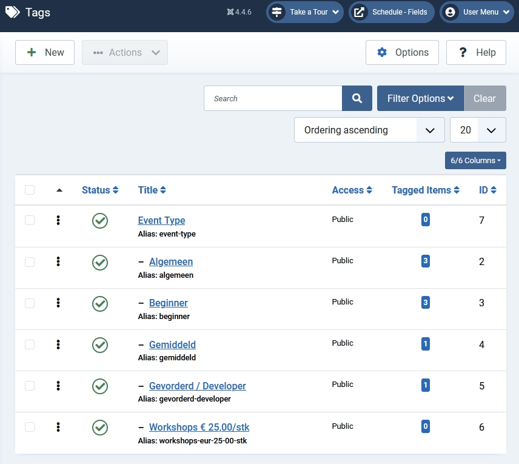
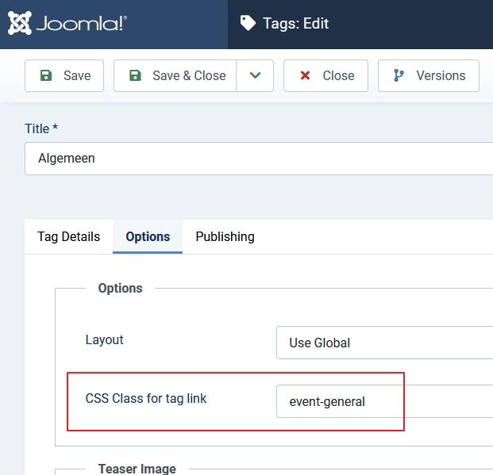

# Episode 1: Introduction and core solution

## Template overrides
See folder /template_overrides_event_schedule

## Hopper
The installable export package for the of the Event Schedule example with com_hopper will be uploaded in the /hopper_packages folder.

The Hopper component, to transfer an additional fields configuration to another site, can be found at https://github.com/pjdevries/com_hopper.
N.B.: com_hopper is made for Joomla 5 and does not work on Joomla 4.
## Tags
In the example I've used 5 tags for styling of the event types. I put them all under a tag 'Event Type'.

In those tags I used the tag_link_class parameter ('CSS Class for tag link' under Options) to give a class to the events. That class is used for the background colours.

I've used the following tags and classes:

| Tag title             | CSS class          |
|-----------------------|--------------------|
| Algemeen              | event-general      |
| Beginner              | event-beginner     |
| Gemiddeld             | event-intermediate |
| Gevorderd / Developer | event-advanced     |
| Workshops € 25,00/stk | event-workshop     |

