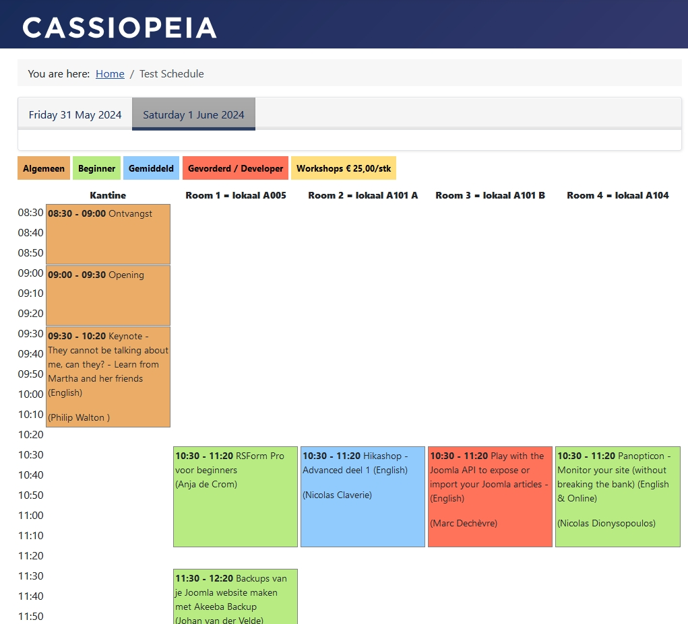

# Episode 1: Introduction and core solution

## Template overrides
See folder /template_overrides_event_schedule

## Hopper
The installable export package for the of the Event Schedule example with com_hopper can be found in the  folder.

The Hopper component, to transfer an additional fields configuration to another site, can be found at https://github.com/pjdevries/com_hopper. Version 1.0.0 can be downloaded from https://github.com/pjdevries/com_hopper/releases/tag/v1.0.0

N.B.: com_hopper is made for Joomla 5 and does not just work on Joomla 4. To make a working version for Joomla 4 you'll have to get rid of the index on title and alias in the #__hopper_projects table in /administrator/components/com_hopper/sql/mysql/install.sql (only necessary if you're on MySql < 8) and change Joomla\Filter\OutputFilter to Joomla\CMS\Filter\OutputFilter in /administrator/components/com_hopper/src/Model/ProjecModel.php (maybe not necessary anymore in later versions of Joomla 4, because it is only the  missing Language package of the Joomla Framework). Done that in the 1.0.0 version of the Event Schedule Hopper-package. Still at least PHP 8.1 is necessary.
## Tags
In the example I've used 5 tags for styling of the event types. I put them all under a tag 'Event Type'.

In those tags I used the tag_link_class parameter ('CSS Class for tag link' under Options) to give a class to the events. That class is used for the background colours.

I've used the following tags and classes:

| Tag title             | CSS class          |
|-----------------------|--------------------|
| Algemeen              | event-general      |
| Beginner              | event-beginner     |
| Gemiddeld             | event-intermediate |
| Gevorderd / Developer | event-advanced     |
| Workshops € 25,00/stk | event-workshop     |

## Extended Event Schedule
The extended event schedule has two more entities: 
* **locator**: the container, section, starttime and endtime are  moved from the event to this locator. An event can now be scheduled multiple times.
* **actor**: The one who does the event, for instance a speaker on a conference.

A locator is implemented with a subform-field in an event. We can have multiple locators: an event can be scheduled more than once. Hence the fieldname in plural: 'locators'.

An actor is implemented with another article. The title is the name of the actor. The description is the biography of the actor. We use the into image and the article image to show a picture of the actor. We have field 'actors' in an event. We now used the ACF articles field for it. In the free version it has one standard layout: a list of titles (here: names) that link to an article about them. In an actor-article we have a similar field referring the events that actor does. We can add more fields (like website etc.) of the actor. I retrieved the original article in the override, so we can make anything of that actor (for instance: showing some details on hover or displaying information in a modal window).

The actors can be seperately shown in a category blog (category = Event Actor). We can have multiple actors to do an event, for instance multiple speakers for one presentation. An actor can do multiple events. For the category blog overview of the actors we made some CSS in user.css in the regular cassiopeia template.

Such a category blog overview for 6 of the speakers on JoomlaDagen 2024 (as an example), with links both on the name and on the picture.

