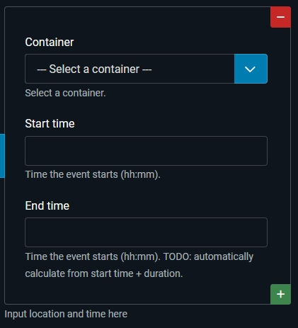
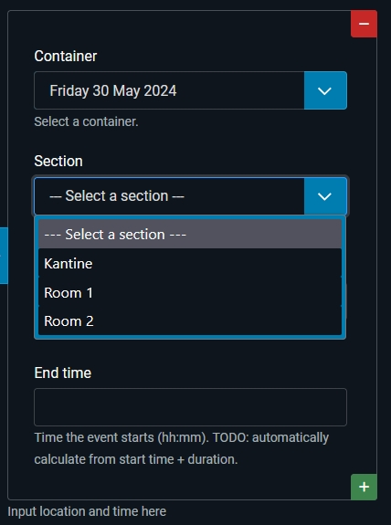

# Episode 3: Creating a component

## The component so far
In the folder "com_eventschedule" of this episode you'll find the component so far.
As we've spent most time on the basic backend, you'll find the entities and 
their relations in the administrator as described in the article. 
Also the cascading dynamic select boxes are in this example.

The basic frontend (with the schedule) is about the same as we saw in episode 1, 
but now the variables are prepared in the model and put into the view + template layout. 
The actors and some styling still have to be done.

## Relations
Emphasis in this episode was on relations.

It was also an exploration of how core Joomla implements 
entities (and their relations). Main conclusion: **basicly a Table-object 
is the active record implementation of entities**, but it is mainly used for 
storing, updating and deleting the entities. 

Relations are partly handled in Table-objects in core Joomla: 
* n:1 relation: the owning side has the foreign key stored in the database table
* n:n relation: the junction table is handled in the Table-object (a.o. user groups)

**The rest of relations is all handled in the model**. The role of entity is 
therefore divided between the Table-object and the model. 
In Laravel the model is the entity; idem in the new entities package in the framework. 

One of the things I wanted to do is using relations in core Joomla, 
as much as possible in the way core Joomla does it, not using any ORM.

## Cascading dynamic dropdowns with sql-field
It is in fact a little bit simpler than described in the developers manual: 
the reload() method in the controller already  stores all input from the form in the 
user state and based on that the form is rendered again. In our case: 
the sections-dropdown is rendered based on the value of the container-dropdown
(in the locator). No need to explicitly also store the container_id in the user state. 
The "context"-attribute is also not necessary (and not used).

Will correct it in the developers manual for the sql-field.

I've put a "showon" attribute on the section: only show that dropdown when a container 
has been chosen: `showon="container_id!:"`.

My (cascading) section-dropdown field definition looks like this:
```
    <field
            name="section_id"
            type="sql"
            sql_select="section.id, section.section_name"
            sql_from="#__eventschedule_container_section AS junction"
            sql_join="#__eventschedule_sections AS section ON section.id=junction.section_id"
            sql_order="section.ordering ASC"
            sql_filter="container_id"
            sql_default_container_id="0"
            header="COM_EVENTSCHEDULE_LOCATOR_FIELD_SECTION_SELECT_HEADER"
            key_field="id"
            value_field="section_name"
            label="COM_EVENTSCHEDULE_LOCATOR_FIELD_SECTION_LABEL"
            description="COM_EVENTSCHEDULE_LOCATOR_FIELD_SECTION_DESC"
            showon="container_id!:"
    />
```
#### Example
Say we have two containers:
* Friday 30 May 2024
* Saturday 1 June 2024

In both containers the section "Kantine" is available. On Friday Room 1 and Room 2 are available 
and on Saturday Room 3 and Room 4.

When no container has been chosen we don't see a field to choose a section in our locator:



When Friday is chosen as container, we see the options Kantine, Room 1 and Room 2:




When we change our container-choice to Saturday we'll see Kantine, Room 3 and Room 4.

## Multiple subform field
In order to automatically store and retrieve a multiple subform field, 
you'll have to put the field name of that subform in the `$this->_jsonEncode array of the Table.
In our case: the locators that are embedded in the event-entity. 
In the EventTable we put:
```php
// Put multiple subform field-name in $this->_jsonEncode array
        if ( ( !empty( $array[ 'locators' ] ) && ( is_array( $array[ 'locators' ] ) ) ) ) {
            $this->_jsonEncode[] = "locators";
        }
```
Will add it to the developers manual for the subform field.
